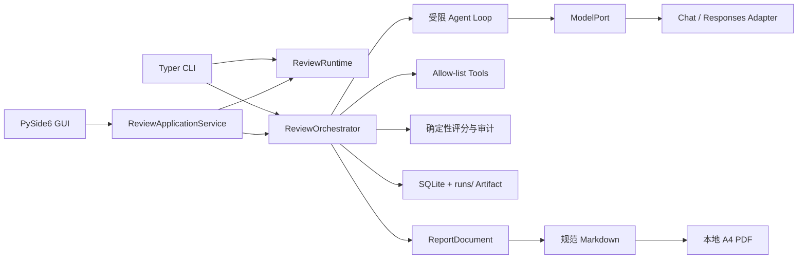

# 开发与维护指南

本指南面向需要运行、学习、扩展或维护 Paper Reviewer 的开发者。项目是一个以 Python 约束工作流的论文评测 Harness：模型只负责受限的语义判断，代码负责预算、工具权限、状态机、证据校验、持久化和报告生成。

系统定位为教师和高校质控人员使用的 AI 辅助预评工具，不生成浙江省教育厅正式抽检结论，也不应直接用于处分、学位决定或自动认定学术不端。

## 1. 开发环境

项目要求 Python `>=3.12,<3.15`，Windows 开发建议使用 Python 3.12。推荐用仓库内的 `.venv`，不要把密钥或运行数据写入 Git 工作区。

```powershell
py -3.12 -m venv .venv
.\.venv\Scripts\python.exe -m pip install uv
.\.venv\Scripts\uv.exe sync --extra dev
Copy-Item .env.example .env
```

`paper-review` CLI 启动时会加载 `.env`，因此可用其中的 `OPENAI_API_KEY`、`DEEPSEEK_API_KEY` 作为内置 Provider 的兼容回退。桌面应用优先读取 Windows Credential Manager，缺少内置凭据时才读取进程环境变量；不要把“`Settings` 能从 `.env` 读取 `PAPER_REVIEW_*` 配置”理解为 GUI 会自动把 `.env` 中的 API Key 注入进程。自定义 Provider 不使用环境变量兜底。`.env` 已被忽略，禁止提交真实密钥。

初始化本地 CLI 存储并检查环境：

```powershell
.\.venv\Scripts\paper-review.exe init
.\.venv\Scripts\paper-review.exe doctor
```

校验 Rubric 和 Reviewer Profile：

```powershell
.\.venv\Scripts\paper-review.exe rubric validate configs/rubrics/zhejiang_undergraduate_thesis_v2.yaml
.\.venv\Scripts\paper-review.exe profile validate configs/review_profiles/zhejiang_undergraduate_specialists_v1.yaml
```

## 2. 目录与职责

```text
src/paper_reviewer/
├─ domain/       论文、Rubric、Provider、评阅结果和任务状态等纯领域模型
├─ ports/        Model、文档解析、网页搜索和学术检索的协议
├─ adapters/     PyMuPDF、OpenAI/Responses、DDGS、学术检索、SQLite、Credential Manager
├─ application/  Service、Orchestrator、运行资源、状态机、事件和任务 Artifact
├─ agents/       Reviewer、Panel Reviewer、Meta Reviewer 和受限 Agent Loop
├─ validation/   评分、审计、证据引用和 3+2 面板的确定性逻辑
├─ reporting/    ReportDocument、展示配置、Markdown 和 PDF 导出
├─ retrieval/    检索排序等无模型领域辅助逻辑
├─ tools/        论文读取、证据读取和 allow-list 工具注册
├─ gui/          PySide6 Qt Widgets 桌面端、主题、页面、模型和线程桥接
└─ resources/    内置配置和资源入口
configs/         默认 Rubric 与 Reviewer Profile 的唯一源文件
migrations/      Alembic 迁移脚本
scripts/         便携版构建脚本
tests/           unit、integration、gui、characterization 回归测试
```

安装包和 PyInstaller 都从 `configs/rubrics`、`configs/review_profiles` 复制内置配置；修改默认配置时不需要维护第二份手工副本。`paper-reviewer.spec` 还收集 Prompt、Fluent 资源、打印 CSS、图标和迁移文件。

## 3. 运行数据流



一次评测的大致顺序为：解析论文 → 建立学术/外部证据 → 专业 Reviewer 或 v2 评分 Reviewer → 确定性审计 → v2 的 3 名初评专家，必要时追加 2 名复评专家 → Meta Review → 生成报告。待人工复核的 v2 任务会在 AI 阶段结束后生成完整报告并进入 `reported_pending_human_review`，决定保存后只做本地确定性重算，不重新调用模型。

### 3.1 应用层

- `ReviewApplicationService` 是 GUI 与服务调用的公共门面，负责校验 Rubric、创建/恢复任务、Provider 管理、人工复核和报告导出。
- `ReviewRuntime` 为一次 start/resume 操作创建模型、SQLite session、学术检索客户端和可选 DDGS 客户端，并在退出时关闭它们。
- `ApplicationUnitOfWork` 把数据库 Engine 限定在一次异步操作内，适配 GUI 每个 `QThread` 独立事件循环的约束。
- `ReviewOrchestrator` 负责任务创建、快照、配置哈希和阶段编排；阶段共享可变的 `PipelineContext`。每个成功阶段写入 `completed_stages` 和检查点，恢复时只执行缺失阶段。
- `RunEvent` 同时通过 Qt/服务事件桥接到界面，并写入数据库事件与 `trace.jsonl`；`application/run_events.py` 负责事件的稳定展示投影。

### 3.2 Agent Loop

`agents/loop.py` 保留 `run_bounded_agent()` 门面，核心实现位于 `loop_components.py`：

1. `ModelTurnRunner` 发出单次模型请求并把可用的 assistant 上下文附加到内存消息。
2. `ToolBatchRunner` 按响应顺序执行 allow-list 工具，累计工具调用预算并追加 tool 结果。
3. `OutputParser` 对最终 JSON 或强制 `submit_final_result` 工具调用做 Pydantic 校验。
4. `RepairState`、截断检测和修复提示处理有限次数的输出修复。

必须保持 `AgentBudget`、幂等键、repair context、最大轮次、最大工具调用数、事件顺序和最终工具行为。Prompt 要求模型把论文和外部网页内容当作数据；程序能确定性强制的是注册表、参数 Schema 和 Reviewer Profile allow-list，不能把 Prompt 约束当作绝对提示注入防护。

### 3.3 Provider 边界

`ports/model.py` 的 `ModelPort` 是 Agent 与应用层使用的模型端口；纯领域模型不依赖 OpenAI SDK 类型或模型端口。

- `OpenAICompatibleAdapter` 负责 Chat Completions：消息使用 `messages`，工具使用嵌套 `function` 结构，并发送 `temperature` 和 `max_tokens`。
- `OpenAIResponsesAdapter` 负责 Responses API：system 内容进入 `instructions`，工具为扁平 function tool，发送 `store=False` 和 `max_output_tokens`；JSON-safe output item（可能包含 encrypted reasoning）只在当前 Reviewer coroutine 内回放，不持久化远端 response ID、reasoning 明文或 continuation。
- `application/providers.py` 将内置和自定义连接解析为不可变 `ProviderSnapshot`。快照含 Provider 引用、协议、端点、端点指纹和实际模型，不含 API Key。
- `adapters/models/factory.py` 按快照选择适配器；不能把 Chat 和 Responses wire format 合并，也不能静默从 Responses 回退到 Chat。
- CLI 当前只创建和恢复内置 Chat Provider；自定义 Provider 与 Responses 任务由桌面端创建、运行和恢复。GUI 通过 `ReviewApplicationService` 使用同一 Provider Registry。

重试由适配器边界的 Tenacity 策略控制，OpenAI SDK 的自动重试为零。连接错误、超时、限流和服务端错误可重试；认证、参数、模型不存在和输出校验错误不应作为传输重试处理。

### 3.4 持久化、检查点与恢复

桌面端数据在 `%LOCALAPPDATA%\PaperReviewer\PaperReviewer`：

```text
data/paper-reviewer.db     SQLite 数据库
runs/<run_id>/              任务快照、报告、证据和 trace
logs/paper-reviewer.log     桌面端日志
config/preferences.json     非秘密偏好
config/providers.json       非秘密 Provider 配置
```

CLI 默认使用当前目录下的 `paper-reviewer.db` 和 `runs/`，具体路径仍可由 `PAPER_REVIEW_*` 设置覆盖。桌面凭据优先进入 Credential Manager，内置 Provider 也可从环境变量回退；API Key 不进入上述 JSON、数据库、Trace、报告或配置哈希。

典型任务 Artifact 包括：`provider.json`、`rubric.json`、`review-profile.json`、`panel-profile.json`、`request-context.json`、`document.json`、`reference-checks.json`、`evidence.json`、`audit.json`、`diagnostic-score.json`、`hard-rule-assessments.json`、`human-rule-decisions.json`、`expert-opinions.json`、`expert-panel-decision.json`、`panel-decision.json`、`human-panel-decision.json`、`meta-review.json`、`evaluation-report.json`、`report-presentation.json`、`report.json`、`report.md`、`run-summary.json` 和 `trace.jsonl`。不是每种 Schema 或旧任务都会有全部文件。

`RunArtifactStore` 只负责任务目录内的 JSON/Pydantic 文件，写入采用同目录临时文件、flush/fsync 和原子替换。数据库的 `run_events`、`artifacts`、`review_results`、`evidence_items` 和 `hard_rule_decisions` 仍保留，恢复时遵循现有文件检查点、数据库 Artifact 和旧任务快照的回退优先级。不要为了“统一”而删除旧快照回退：缺少 `provider.json`、`request-context.json`、`panel-profile.json` 或 `report-presentation.json` 的历史任务仍必须按兼容规则读取。

数据库启动时执行 SQLite 的兼容升级和 `Base.metadata.create_all`；仓库还保留 Alembic 的 `0001_initial`、`0002_run_scoped_identifiers`、`0003_evaluation_persistence`。`0002` 的降级可能造成标识合并和数据丢失，禁止执行破坏性 downgrade。数据库或任务目录备份应在应用退出后同时复制数据库和对应的 `runs` 目录。

## 4. GUI、CLI 与 Widget Gallery

开发时启动桌面端：

```powershell
.\.venv\Scripts\paper-review-app.exe
```

开发专用 Fluent 控件状态画廊：

```powershell
.\.venv\Scripts\paper-review-gallery.exe
```

GUI 使用 Qt Widgets 和 Windows 原生标题栏。`MainWindow` 管理导航和页面；长任务由 `AsyncTaskThread` 在专用线程的 asyncio loop 中运行，Qt Signal 将事件送回主线程。控件只能在 GUI 主线程更新。`AsyncOperationRegistry` 负责 worker 生命周期、取消和窗口关闭时的回收。

维护 GUI 时必须保留：

- 既有 Signal 签名、`objectName`、Accessible Name/Description、Tab 顺序和 selection model 身份。
- `Busy`、`Invalid`、`Disabled`、取消确认、窗口状态和 splitter 持久化行为。
- 唯一的 `FluentThemeManager`、语义 Token、QPalette 和全局 QSS；页面不得添加局部十六进制颜色或临时样式。
- GUI 不启动 CLI 子进程，也不解析 Rich 终端输出。

CLI 的入口来自 `pyproject.toml`：`paper-review`、`paper-review-app` 和 `paper-review-gallery`。常用命令：

```powershell
.\.venv\Scripts\paper-review.exe run paper.pdf `
  --provider openai `
  --model YOUR_MODEL_NAME `
  --discipline-name "计算机科学与技术" `
  --allow-cloud-processing `
  --non-classified

.\.venv\Scripts\paper-review.exe status RUN_ID
.\.venv\Scripts\paper-review.exe report RUN_ID
.\.venv\Scripts\paper-review.exe resume RUN_ID
```

CLI 的 v2 云端运行必须有专业名称、`--allow-cloud-processing` 和 `--non-classified`；涉密材料必须拒绝。`--no-external-search` 可关闭 DDGS、学术检索和参考文献核验。CLI 恢复自定义/Responses 任务时应给出桌面端提示，不应绕过快照和凭据规则。

## 5. 扩展约定

### Rubric 与 Reviewer Profile

1. 在 `configs/rubrics/` 新增 YAML，并先运行 `paper-review rubric validate <path>`。
2. v1 保留旧兼容规则；v2 对未知字段严格报错，并要求政策来源、分组覆盖、0–4 锚点、`dual_advisory`、结构化否决项和 3+2 面板。
3. 在 `configs/review_profiles/` 为每个 Reviewer 声明 `reviewer_id`、标题、维度 ID/标签、allow-list 工具和预算。
4. 运行 `paper-review profile validate <path>`，再补充对应的 Rubric、审计和报告测试。

不要在 GUI 或 Prompt 中硬编码指标名称、权重或规则；报告展示通过 `ReportPresentation` 从当前 Rubric 快照解析标题。新增字段必须同时考虑 Pydantic 模型、审计、Artifact 读取、历史回退和 Markdown/PDF/GUI 投影。

### Provider

内置 Provider 只在 Registry/适配器中扩展，必须明确协议和固定端点。自定义 Provider 只能通过桌面端管理：Base URL 必须使用 HTTPS，HTTP 仅允许严格回环地址；不得包含 userinfo、query、fragment 或具体 `/responses`、`/chat/completions` 路径。端点或协议变化必须创建新的 Provider ID，旧任务仍依赖任务快照。

### 报告

先在 `reporting/adapters.py` 为领域结果构造 `ReportDocument` 包装和安全展示元数据，再由 `renderer.py` 在保留历史兼容分支的前提下生成规范 Markdown；`ReportDocument` 是渲染器内部的只读投影，不是 GUI 的报告模型。导出服务优先逐字节复制任务已有的 `report.md`，缺失时才通过渲染器从快照重建；PDF 由 `exporter.py` 消费同一 Markdown 快照，在本地渲染和验证。GUI 使用 Service 的 `ReportView`，共享展示映射但不直接消费 `ReportDocument`。历史任务没有 `report-presentation.json` 时按 `legacy` 处理；新任务按 `zh_cn_v1` 处理。报告不能读取或嵌入外部图片、远程资源、API Key 或论文全文之外的未授权数据。

### 脱敏

Provider 兼容性测试的界面结果只从 `message`、`code`、`param`、响应状态、截断原因、finish reason、output item 类型和是否只有普通文本等白名单元数据生成，并清洗已识别的 Key、Bearer Header 和 URL。任务持久化错误使用数据库原因白名单或有界的外部错误清洗，但不是所有异常都能归入同一白名单；GUI worker 还会生成完整 traceback 信号。任何日志、Trace、错误消息或 traceback 在提交前都必须人工检查，不能假定其中永远没有论文片段或其他敏感内容。数据库 Engine 使用 `hide_parameters=True`，不要把 SQL 参数拼进错误字符串。

## 6. 质量检查

提交前使用仓库实际配置运行：

```powershell
.\.venv\Scripts\ruff.exe check src tests migrations
.\.venv\Scripts\mypy.exe src
.\.venv\Scripts\python.exe -m pytest
git diff --check
```

测试分为 `tests/unit`、`tests/integration`、`tests/gui` 和 `tests/characterization`。重构必须同时验证核心逻辑与 GUI 契约；尤其检查旧任务恢复、Schema v1、Chat/Responses wire shape、工具调用、取消、人工复核、报告导出和秘密不落盘。不能用“测试通过”替代真实 Provider 兼容性判断，也不能在没有实际运行时把结果写成通过。

维护时优先使用小范围、可回滚的变更：先添加 characterization/回归测试，再拆分实现；保持 Service/Port 公共边界；不要把 Chat 和 Responses 适配器合并成依赖协议分支的单个大方法；不要把数据库迁移、Artifact 安全存储和 Preferences/Provider 配置存储混为一谈。

## 7. 相关文档

- [架构说明](../architecture.md)
- [桌面端架构](../desktop-app.md)
- [Provider 契约](../provider-contract.md)
- [Rubric 规范](../rubric-spec.md)
- [构建与发布](BUILD_AND_RELEASE.md)
