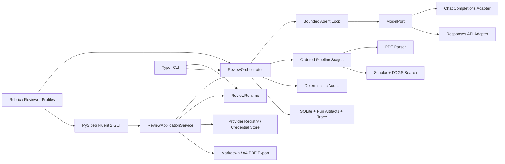
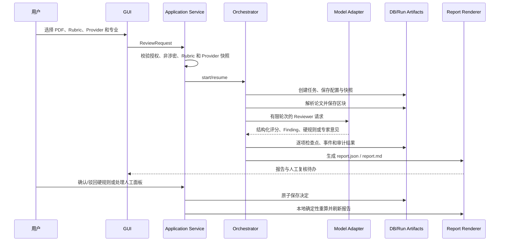

# 论文评测项目报告

## 摘要

Paper Reviewer 是一个以 Python 实现的、证据约束的学术论文评测 Harness。系统把论文解析、证据收集、模型调用、工具权限、预算、结构化输出校验、确定性审计、检查点、恢复和报告生成放在应用程序控制面；LLM 只负责限定预算内的语义判断。

当前内置的浙江本科论文 Rubric 实现“诊断评分 + 抽检风险评议”双层结果：九项指标生成实验性诊断分，政治方向和学术诚信作为独立否决项，3+2 独立专家面板给出风险意见。系统定位是教师和高校质控人员使用的 AI 辅助预评工具，不冒充教育主管部门的正式抽检结论。

本文同时是面向开发者和学习者的技术说明。最终测试数量、构建哈希、运行耗时等只能由最终验收文档填写，不在本文中预先虚构。

## 1. 背景、目标与定位

### 1.1 背景

本科毕业论文评阅同时包含专业判断、论文证据核对、学术规范检查和风险识别。单次 LLM 调用可以生成文字意见，但不能天然保证引用页码正确、评分权重一致、工具调用可控、失败后可恢复或人工决定可追溯。因此项目选择“LLM 语义判断 + Python 确定性 Harness”的组合。

### 1.2 规则与产品边界

内置 Rubric 的政策上下文来自《浙江省教育厅关于印发〈浙江省本科毕业论文（设计）抽检实施细则（试行）〉的通知》，配置记录文号 `浙教高教〔2023〕5号`、生效日期和源文件 SHA-256。系统使用这些规则建立本科论文预评维度，但并不声称复现教育厅的正式抽检程序或行政结论。

第一版主要支持普通本科论文 PDF。论文必须是可抽取文本的 PDF；扫描件、设计作品、图纸、特殊培养成果和涉密材料需要人工或专门流程。开始云端评测前，用户必须确认已获得处理授权并确认材料非涉密。

### 1.3 目标用户

- 指导教师：在正式评阅前获取按页码和证据组织的诊断意见。
- 高校质控人员：批量查看任务状态、Rubric 版本、风险待办和审计结果。
- 后续开发者/学习者：研究 Agent loop、Provider 适配、结构化输出、恢复和桌面端工程实践。

## 2. 核心概念：Agent、Harness、Memory 与 Rubric

### 2.1 Agent 与 Harness 的关系

本项目中的 Agent 是带有系统提示、用户任务、受限工具、模型预算和结构化输出的单个 Reviewer 作业。Reviewer 可以读取论文块和允许的证据，也可以在 Profile 允许时调用检索工具；它不能直接写数据库、改变评分规则或执行工具。

Harness 是围绕 Agent 的应用控制层，负责：

- 创建和恢复任务状态；
- 给每个 Reviewer 限制模型轮数、工具调用次数、超时和修复次数；
- 检查 JSON/Pydantic 输出、Finding、证据、页码和引用关系；
- 记录事件、Trace、检查点和结构化 Artifact；
- 并发运行专业 Reviewer，但保持独立专家面板隔离；
- 通过确定性代码计算评分、硬规则状态、专家票和最终风险路径。

因此，Harness 不是另一个“更大的模型记忆”，而是为模型输出提供可校验、可审计、可从检查点恢复的软件边界；它不保证模型语义判断本身正确。

### 2.2 LLM 自带记忆与 Agent Memory

模型 API 本身通常只看到当前请求中的上下文，不会自动知道上一次任务。Responses API 的 output continuation 只在当前 Reviewer 协程内存中回放，`store=False`，不使用 `previous_response_id`，也不把远程响应链写入磁盘。

项目中区分四类运行内存：

| 类型 | 内容 | 生命周期 |
| --- | --- | --- |
| 工作记忆 | 当前 Agent 的消息、工具调用和工具结果 | 单个 Reviewer 作业，受预算约束 |
| 证据记忆 | 论文稳定页码/区块、外部学术元数据和证据 ID | 当前任务，可随检查点恢复 |
| 公共元数据缓存 | 与 Provider 无关的公开检索元数据 | 可复用，但不等同于个人长期记忆 |
| 长期评阅记忆 | 跨任务记住学生或论文内容 | MVP 不提供 |

数据库、任务目录和报告是“可追溯的任务状态”；应用本身不会把论文建立为跨任务长期记忆或训练集。论文发送到云端后如何保留和使用数据，仍取决于用户所选 Provider 的合同与隐私条款，使用者必须另行确认。Prompt 要求模型把外部文档视为不可信数据而不是指令；程序能够确定性强制的是工具注册、allowlist 和参数 Schema，不能把 Prompt 约束描述为绝对安全保证。

### 2.3 Rubric 的作用

Rubric 是版本化、可校验的评测契约，定义评分维度、权重、锚点、证据政策、硬规则、专家策略和适用范围。前端和报告层动态读取 Rubric，不把维度名称或权重写死在 UI。任务创建时保存 Rubric 快照，之后修改默认 YAML 不改变历史任务。

## 3. 评分与风险决策模型

### 3.1 九项诊断评分

内置浙江本科 Rubric 使用整数 `0–4` 五级锚点，再按权重换算为百分制诊断分。诊断分没有项目及格线，不直接决定抽检风险。

| 一级分组 | 二级指标 | 权重 |
| --- | --- | ---: |
| 选题意义 | 选题目的 | 10% |
| 选题意义 | 研究意义 | 10% |
| 逻辑构建 | 层次体系 | 10% |
| 逻辑构建 | 逻辑结构 | 10% |
| 专业水平 | 综合应用知识能力 | 10% |
| 专业水平 | 分析解决问题能力 | 20% |
| 专业水平 | 创新能力 | 10% |
| 学术规范 | 行文规范 | 10% |
| 学术规范 | 引用规范 | 10% |

计算公式：

```text
诊断总分 = Σ（指标等级 ÷ 4 × 指标权重）
```

五级锚点为：

| 等级 | 含义 |
| ---: | --- |
| 0 | 核心要求缺失、严重不符合或没有可验证证据 |
| 1 | 存在实质性缺陷，明显不足 |
| 2 | 基本达到本科最低要求，但仍有较明显不足 |
| 3 | 充分达到要求，论证和证据较完整 |
| 4 | 表现突出，明显高于一般本科要求 |

每项评分还必须通过权重、指标归属、论文证据和外部证据政策审计。等级、权重、理由、证据和置信度共同保存在结构化 `CriterionAssessment` 中，确定性聚合结果另存为 `DiagnosticScore`。

### 3.2 独立否决项

当前内置配置包含两个需要人工确认的硬规则：政治方向、学术诚信。AI 允许的状态是：

- `not_detected`：未发现可支持的嫌疑；
- `suspected`：发现需要人工核查的嫌疑，并必须提供论文或外部证据；
- `not_assessable`：现有材料不足以判断。

AI 不能写入“确认成立”或“确认不成立”。用户在评测完成后的报告页处理待办，填写复核人和理由；可以在线下查看查重报告后在理由中记录名称或结论，但第一版不上传、解析、读取或保存检测报告路径。

最终优先级是：人工确认成立的硬规则触发风险；任何待办尚未处理时结论保持待定；人工面板已经给出结论时采用人工面板结论；否则采用确定性 3+2 专家面板结果。

### 3.3 3+2 独立专家面板

初轮运行 3 名互相隔离的完整评阅专家，每名专家看全部评分维度、论文证据和专业上下文，但看不到其他专家意见。专家只能输出合格、不合格或无法判断；不合格必须关联已有 Finding 和论文证据。

决策路径：

1. 任一初评专家无法判断：不执行复评，继续生成预评报告并创建人工面板待办。
2. 初轮至少 2 名不合格：触发存在问题风险。
3. 初轮 0 名不合格：不触发专家面板风险。
4. 初轮恰好 1 名不合格：追加 2 名独立复评专家。
5. 任一复评专家无法判断：创建人工面板待办；否则复评至少 1 名不合格即触发风险，复评全部合格则不触发专家面板风险。

专家结果完成后立即写入任务 Artifact 和数据库，恢复时只运行缺失的专家，不重复已完成调用。

### 3.4 评测完成与人工复核

所有可自动执行的阶段完成后，任务可能为 `reported` 或 `reported_pending_human_review`。后者表示“AI 评测已完成，人工复核尚未完成，当前风险结论待定”，不是正在运行的任务；报告可以查看和导出。人工决定只触发本地确定性重算、审计和报告刷新，不再调用 LLM；组成报告的文件分别原子替换，但整个多文件 bundle 不是跨文件事务。

## 4. 总体架构

### 4.1 分层结构



### 4.2 运行数据流



CLI 不经过 `ReviewApplicationService`：它复用 `ReviewRuntime`、Provider 中立端口和 `ReviewOrchestrator`，并保留仅支持内置 Chat Provider 的命令行边界。

### 4.3 代码目录职责

| 目录 | 职责 |
| --- | --- |
| `domain/` | Rubric、Review、Provider、Run、Evidence、Document 等纯领域模型 |
| `ports/` | 模型、文档解析、学术检索和 Web Search 的抽象接口 |
| `agents/` | Reviewer、Panel Reviewer、Meta Reviewer 与有界 Agent loop |
| `application/` | Service、Orchestrator、PipelineContext、Runtime、状态机和校验协调 |
| `adapters/models/` | Chat Completions 与 Responses API 的 wire-format 适配 |
| `adapters/documents/` | PyMuPDF 论文解析 |
| `adapters/search/`、`adapters/scholarly/` | DDGS、OpenAlex、Crossref、arXiv |
| `adapters/persistence/` | SQLAlchemy/SQLite 行、Artifact、事件、证据与检查点持久化 |
| `reporting/` | 展示配置、ReportDocument、Markdown 和 PDF 导出 |
| `gui/` | Fluent 主题、主窗口、页面、模型/线程和控件 |
| `configs/` | Rubric 与 Reviewer Profile 的可追踪配置源 |
| `migrations/` | Alembic 和运行时 SQLite 兼容升级 |

## 5. 关键模块说明

### 5.1 Application Service 与 Orchestrator

`ReviewApplicationService` 是 GUI 的用例 façade，负责请求校验、Provider 解析、任务列表、报告读取、人工复核和导出；CLI 直接复用运行资源上下文和 Orchestrator。`ReviewOrchestrator` 除了按照明确阶段编排，还负责任务创建、配置哈希、任务快照、阶段检查点、审计与报告落盘：

```text
解析论文 → 收集外部证据 → 专业化评分/Reviewer → 确定性审计
→ 3 人初评 → 条件性 2 人复评 → Meta 评语 → 报告验证与生成
```

阶段在可变的内部 `PipelineContext` 中共享当前运行记录、论文块、证据、结果和审计信息；Provider 等不可变任务快照仍存放在任务目录中。每次启动/恢复操作使用自己的数据库会话、模型客户端、检索客户端和清理边界，不跨 GUI `QThread` 共享异步资源。

### 5.2 Agent Loop 与 Reviewer

Agent loop 使用 `AgentBudget`、工具 allowlist、最终输出工具和结构化模型验证。模型输出不符合 schema 或证据关系时，在有限 `max_output_repairs` 内使用 repair prompt；超过预算则形成可理解的失败信息并保留已完成检查点。

专业 Reviewer 采用五类角色：选题意义、逻辑构建、专业能力、学术规范、合规与诚信。Meta Reviewer 只汇总和解释意见，不能修改分数、人工决定、专家票、Finding 或最终确定性决策。

### 5.3 证据与检索

PDF 被切为具有稳定 `block_id`、页码、区块类型和内容哈希的论文块。Reviewer 的论文证据必须引用这些区块；外部证据包含来源名称、URL/DOI、稳定 ID 和证据等级。外部搜索支持 DDGS（无需 API Key）以及 OpenAlex、Crossref、arXiv；检索失败通常降级为警告，而不是伪造证据。

参考文献核验会提取编号参考文献，检查 DOI、题名和年份匹配，结果写入 `reference-checks.json`。通过的匹配可作为证据；不确定、冲突、不可用或缺失项明确提示人工核查。

## 6. Provider 与模型协议

### 6.1 统一边界

Agent 与应用编排层依赖 `ModelPort` 和中立的 `Message`、`ModelRequest`、`ModelResponse`、`ToolCall`、`Usage`，不直接引用 OpenAI SDK 的响应类型；纯领域模型不依赖模型端口。Provider Registry 将内置和自定义配置解析成含协议、端点和模型的 `ProviderSnapshot`；任务快照不含 API Key。

### 6.2 Chat Completions

`openai` 和 `deepseek` 默认使用 Chat Completions；`OpenAICompatibleAdapter` 将 system/user/assistant/tool 消息和 function tools 映射到 `chat.completions.create`，并把工具调用、最终文本、usage 和 finish reason 归一化。兼容的自定义 Provider 可以选择同一协议。

### 6.3 Responses API

`openai_responses` 和协议选择为 Responses 的自定义 Provider 使用独立的 `OpenAIResponsesAdapter`：

- system 内容进入 `instructions`；其他消息转换为 Responses input items；
- function tool 使用扁平定义，显式 `strict=False`；
- tool 结果使用 `function_call_output` 与 `call_id`；
- 显式 `store=False`、最大输出 token 和可选的加密 reasoning include；
- 不使用 `previous_response_id`，不持久化远程 response ID；
- 从全部 output items 提取文本、多个 function call、状态、截断原因和 usage；
- 不解析或记录 reasoning 明文；需要延续工具调用时，JSON-safe output item（包括可能存在的 encrypted reasoning 字段）只在当前协程内存中回放。

Responses 的完整 JSON-safe output items 仅附着到当前 assistant 消息，在同一 Reviewer coroutine 的下一轮原样回放；它们不会序列化到 Trace、数据库、检查点、报告或日志。Chat 适配器忽略 continuation 字段。

### 6.4 自定义 Provider

桌面端可维护多个命名自定义 Provider，引用格式为 `custom:<32位十六进制 ID>`。协议固定为 Chat Completions 或 Responses，模型手动填写，不拉取远端模型列表。远程 Base URL 必须 HTTPS；HTTP 只允许严格的 `localhost`、`127.0.0.1` 和 `[::1]`。拒绝 userinfo、query、fragment、控制字符、非法端口和具体 `/responses`、`/chat/completions` 路径。

Base URL 和协议不可原地变更；更换端点或协议创建新配置，保存成功后再归档旧配置。任务使用创建时的 Provider 快照，因此重命名、归档和 Key 轮换不会改变旧任务的端点语义。测试兼容性时发送一次用户确认过的、最多 1024 token 的工具调用探测，不自动重试；界面只显示脱敏的 `message/code/param`、状态、finish reason、output item 类型和“是否只返回普通文本”。

### 6.5 重试与错误

SDK 自动重试关闭，应用层只对连接错误、超时、限流和服务端内部错误使用有限 Tenacity 策略。认证错误、参数错误、模型不存在、Rubric/结构化输出错误不作为传输重试。Provider 兼容性测试使用白名单字段提取；持久化任务错误使用数据库原因白名单或有界清洗，但未分类的本地异常及其 traceback 仍应按敏感材料处理，提交日志前必须人工检查，不能笼统保证其中永远不含论文片段。

## 7. 持久化、检查点与恢复

### 7.1 数据库

SQLite 主要表包括任务 `runs`、事件 `run_events`、文件/JSON `artifacts`、论文块 `document_blocks`、评阅结果 `review_results`、证据 `evidence_items` 和人工硬规则决定 `hard_rule_decisions`。数据库通过 SQLAlchemy async + aiosqlite 访问，`hide_parameters=True` 避免 SQL 异常携带绑定内容。

应用既支持 Alembic 迁移，也保留桌面端启动时的 SQLite 运行时兼容升级。旧数据库会保留已有论文、证据、任务和报告；新增字段采用可兼容方式处理。

### 7.2 任务目录

典型任务目录包含以下非秘密快照或产物（实际文件可能依流程和旧版本不同）：

```text
rubric.json                 Rubric 快照
review-profile.json         专业 Reviewer 快照
panel-profile.json          独立专家面板快照
request-context.json        专业、外部检索和授权上下文
provider.json               Provider 快照，不含 API Key
document.json               论文元数据
evidence.json               证据账本
reference-checks.json       参考文献核验
diagnostic-score.json       诊断分
expert-opinions.json        专家意见
evaluation-report.json      双层评测报告
report.json / report.md     可读取的报告产物
trace.jsonl                 运行事件 Trace
```

文件和数据库都有检查点。恢复时优先使用任务快照，并对缺失的旧快照按历史规则回退：旧 OpenAI/DeepSeek 任务无 Provider 快照时可按原 Chat 语义恢复；自定义 Provider 或 Responses 任务缺少端点快照时拒绝无依据恢复。只重跑缺失 Reviewer/专家结果。

### 7.3 原子写入与安全

任务 Artifact 写入采用同目录临时文件和原子替换；失败时不破坏原文件。Provider 目录损坏时只读报错，不用空配置覆盖。否决项人工决定同时保存为任务 JSON 和可查询的数据库记录；人工面板决定当前只保存为版本化任务 JSON。报告刷新会重新审计并逐文件更新报告，不重跑模型。

## 8. GUI、CLI 与后台线程

### 8.1 桌面 GUI

GUI 使用 PySide6 Qt Widgets、Windows 原生标题栏和统一 Fluent 2 Token/QSS。主窗口包含新建评测、任务记录、Rubric 管理、设置四个导航入口；任务进度和报告是任务详情上下文页。

评测任务运行在专用 `QThread`，线程内部使用自己的 asyncio 事件循环；Qt Signal 将事件送回主线程。控件只能在主线程更新。取消通过线程安全取消任务并保存 `cancelled` 状态；窗口退出时会提示返回应用或取消任务并退出。

报告页按 Rubric 动态渲染九项评分、分组得分、Finding、硬规则、专家意见、决策路径和审计警告。存在待办时顶部显示人工复核卡片。报告输出区域使用纵向滚动，避免长文本被压缩；报告支持导出 Markdown 和 PDF。

### 8.2 CLI

CLI 提供初始化、doctor、Rubric/Profile 校验、`run` 和 `resume` 等命令，适合开发和自动化检查。当前 CLI 创建入口保留 OpenAI/DeepSeek 的既有范围；自定义 Provider、桌面端 Provider 管理和 Responses 任务恢复以 GUI 为主，CLI 遇到不支持的快照应给出明确提示而不是静默回退协议。

### 8.3 可访问性与状态

控件保留对象名、Accessible Name/Description、Tab 顺序和 Fluent 状态属性。错误同时使用文字、图标和字段状态，不只依赖颜色；Busy 状态阻止重复提交；高对比度、浅色、深色、系统主题和常用缩放比例属于 GUI 验收范围。

## 9. 报告与导出

### 9.1 展示层

报告层新增只读 `ReportDocument` 包装和 Legacy/Evaluation 适配器，用于集中报告类型、Provider 安全显示和展示元数据；它是 Markdown renderer 内部投影，不是 GUI 的 `ReportView`，也不是 PDF 导出时的独立输入。Markdown 渲染器仍保留必要的历史字段兼容分支，GUI 则通过 Service 提供的 `ReportView` 渲染。`ReportPresentationProfile` 支持 `legacy` 和 `zh_cn_v1`：历史已有报告且无展示配置时保留 legacy；新生成的报告写入展示配置，使用 Rubric 自身中文标题，将 `hierarchy_system`、`risk_triggered` 等结构化指标和状态转换为中文。PDF 是规范 Markdown 的本地派生表示。

内部 ID 继续存在于 JSON、Trace、检查点和数据库中，用于审计和恢复；新版报告隐藏或中文化指标、分组、规则、专家和 Finding 的机器标识。为保证证据追溯，`block_id`、`evidence_id` 和任务 ID 仍可能在报告或详情中显示。模型生成的论文原文、外部文献标题、URL 和用户输入不做模糊翻译，只对已知结构化标识进行受限替换。

### 9.2 Markdown

Markdown 是审计基准产物。若任务已有规范 `report.md`，导出服务逐字节复制；旧任务缺少 Markdown 时根据 Rubric、Audit、Evaluation/MetaReview 快照确定性重建。导出不修改任务状态、Trace、数据库或原始报告。

### 9.3 PDF

PDF 使用现有 PySide6 的 `QTextDocument + QPdfWriter` 本地生成，固定白底 A4 纵向、约 20mm 页边距、中文系统字体回退、表格边框、自动分页和页脚页码。不加载 Markdown 中的本地/远程图片、外部 CSS 或网络资源。生成后用 PyMuPDF 重新打开，检查 PDF 签名、页数、可抽取文本和关键免责声明，再原子替换目标文件。

待人工复核的报告可以导出，但 Markdown/PDF 首部必须醒目标注“人工复核尚未完成，当前风险结论待定”。PDF 不嵌入原论文、查重报告、Logo、阴影或深色 App 背景。

## 10. 安全、隐私与伦理边界

- API Key 只进入 Windows Credential Manager 或内置 Provider 的环境变量兼容读取路径，不写入 Provider JSON、任务快照、Trace、数据库和报告；未分类异常日志仍必须按敏感材料检查。
- 配置哈希纳入 Provider 引用、协议、端点指纹和模型。自定义 Provider 的凭据账户绑定 Provider ID、协议和端点指纹；内置 OpenAI Chat/Responses 共用固定凭据账户，并在取 Key 前验证固定端点和协议。
- 远程评测前必须确认处理授权；涉密材料被拦截。
- Prompt 明确要求把外部检索结果和论文内容当作数据；程序确定性执行工具 allowlist 和参数 Schema 校验，但不能保证模型在语义上完全忽略提示注入。
- Provider 兼容性测试只显示经脱敏和长度限制的白名单字段；其他错误路径仍需结合人工日志检查。
- 学术诚信判断只生成嫌疑，不能自动确认抄袭、代写、伪造或篡改。确认权属于具备相应职责的人工复核人员。
- 当前 Rubric 为 `0.x-experimental`，尚未完成教育测量效度验证；界面和报告明确警示不得用于自动处分、学位决定或正式抽检认定，但软件无法控制导出文件之后的实际用途。

其中凭据存储、协议/端点校验、工具 allowlist、状态机和人工确认要求属于程序可强制的边界；数据使用限制、提示注入防护和导出报告用途还依赖 Prompt、Provider 条款、组织制度与使用者责任。

## 11. 等价重构成果与指标记录

本次重构的目标是降低维护复杂度，同时保持功能等价。重构保护线包括：现有 Service/CLI 接口、GUI Signal 和 `objectName`、焦点顺序、状态和事件顺序、LLM 调用次数与协议报文、Artifact 形状、数据库迁移和历史报告兼容。

已形成或应保留的内部边界包括：

- `PipelineContext`：承载有序阶段的共享运行上下文；
- `ReviewRuntime` / `ApplicationUnitOfWork`：单次操作的资源和异步会话生命周期；
- `RunArtifactStore`/任务 Artifact 写入边界：保证原子文件写入与历史优先级；
- `RunEvent`/事件目录：统一实时事件与 Trace 重载的展示信息；
- `BoundedAgentRunner`：将 Agent loop 的调用、工具、验证和 repair 逻辑集中管理；
- `ReportDocument` 与 Legacy/Evaluation adapter：集中 Markdown 报告类型与安全展示元数据，PDF继续由同一规范 Markdown 派生，GUI维持兼容的 `ReportView`；
- GUI presenter/section 模块：拆分大型页面构造，同时保留页面兼容属性。

### 11.1 指标对比表

以下数字来自构建源码提交 `eafd4482e239a4513821e4821da4c329f8fbdea4` 与 2026-08-26 构建记录：

| 指标 | 重构前 | 重构后 | 来源/命令 |
| --- | ---: | ---: | --- |
| `run_detail.py` 行数 | 1862 | 1500 | `Measure-Object -Line` |
| `orchestrator.py` 行数 | 1539 | 1366 | 同上 |
| `service.py` 行数 | 1410 | 1342 | 同上 |
| `ReviewOrchestrator.execute` 复杂度 | 约 42 | 7（77 行） | Ruff C901 审计 |
| `run_bounded_agent` 复杂度 | 约 45 | 1（29 行） | Ruff C901 审计 |
| 正式包大小 | 约 195.35 MiB 目录；约 95 MB ZIP | onedir 404 files / 195.38 MiB；ZIP 90.78 MiB | 构建目录统计；哈希见验收报告 |
| GUI 冷启动中位数 | 约 2.17–2.66 秒 | offscreen N=9：进程至 `MainWindow` 构造中位数 1.5165s | 不含 `show`/首帧，不代表可见首帧性能 |

包体积不是本轮的硬目标；不得通过误删 Qt、PDF、DDGS 或 keyring 动态模块来制造指标下降。若启动或包体积出现变化，应以真实功能自检为优先。

## 12. 测试与发布验收

测试按领域、应用、适配器、报告、GUI、集成和 characterization 分层。重点保护：

- Schema v1/v2 兼容、未知字段和权重/锚点校验；
- 诊断分、硬规则、3+2 决策和人工复核零模型调用刷新；
- Chat/Responses 请求结构、工具调用、截断、状态诊断和 continuation 不落盘；
- Provider URL、凭据隔离、Key 轮换、归档和旧任务快照恢复；
- 任务取消、失败、检查点冲突、恢复和不重复调用已完成 Reviewer；
- Markdown 字节基准、中文展示和 PDF A4/中文/免责声明校验；
- GUI 页面滚动、焦点、Busy/Invalid/Disabled、任务切换和异步回调隔离。

最终实际通过数量、耗时、失败测试和未执行项目必须记录在 [TEST_ACCEPTANCE_REPORT.md](TEST_ACCEPTANCE_REPORT.md)。发布前还需构建 PyInstaller onedir、运行凭据/数据库/资源/报告导出四项自检，并在未安装 Python 的 Windows 环境完成启动和代表性流程冒烟。

## 13. 限制、伦理与后续工作

### 已知限制

- 没有教师金标准数据时，模型置信度是未经校准的自评，不是统计概率。
- 不同专业、论文类型、扫描质量和领域术语会影响证据抽取和模型判断。
- 外部检索只能提供元数据级证据，不能自动证明论文事实或学术不端。
- 报告展示中文化只替换已知 Rubric/结构化 ID，不翻译用户内容、论文原文和文献标题。
- 查重或学术不端检测报告入口暂未实现文件处理。

### 后续建议

1. 使用跨专业本科论文样本和至少两名教师独立评阅，评估等级一致性、意见一致率、证据准确率、误报率、漏报率和重复运行稳定性。
2. 根据人工复核记录校准 Rubric 锚点、Reviewer Profile 和证据政策，并继续保持版本化快照。
3. 继续将复杂度、启动时间、报告 golden fixture 和 EXE 冒烟纳入每次发布门禁。
4. 在有明确授权和隐私评估后，再考虑查重报告解析、脱机模型或批量校园部署。

## 14. 相关资料

- [README.md](../../README.md)：快速安装、CLI/GUI 启动和基本能力。
- [架构说明](../architecture.md)：状态、Reviewer 隔离、Memory、检索与工具边界。
- [桌面端架构](../desktop-app.md)：Qt/Fluent、数据目录、报告导出和打包。
- [Provider 契约](../provider-contract.md)：ModelPort、适配器和重试边界。
- [Rubric 规范](../rubric-spec.md)：Schema v1/v2 校验要求。
- [浙江本科 Rubric](../../configs/rubrics/zhejiang_undergraduate_thesis_v2.yaml)：当前内置评分与风险配置。
